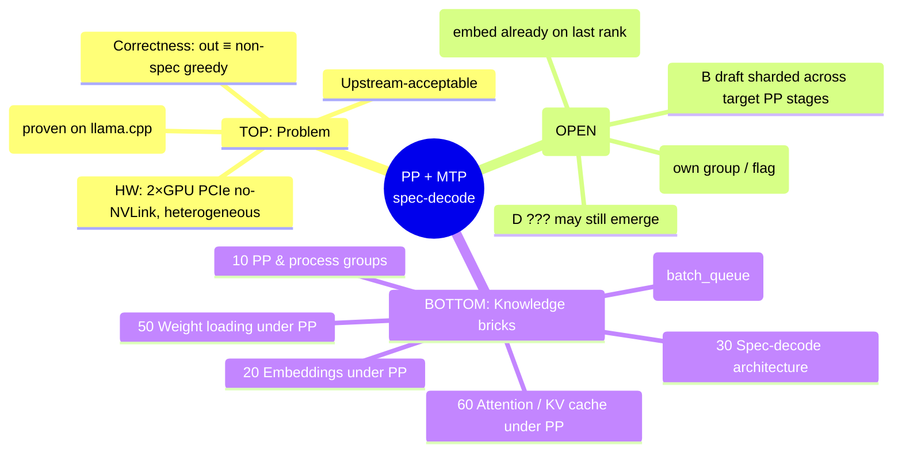

# PP + MTP Speculative Decoding — Research Map (knowledge-base index)

**Purpose.** Living knowledge base for enabling pipeline parallelism (PP>1)
together with MTP speculative decoding in vLLM, for Qwen3.5. Built brick by
brick: each session verifies how a piece of the system works (with code
references), records it here, and closes one or more open questions. New
sessions are pointed at this map to know the front of work and continue.

Companion docs (tiered read — see README's ritual, don't read everything):
- Entry point + read ritual: `../../README.md`
- **Live state** (NEXT ACTION, deliverables, Q1–Q17): `../../state.yml` via `../../tools/build_status.py`
- **Design decision = C** (NOT B); rationale below + brick 60. Option map: `../../specs/2026-06-05-work-branches.md`
- gpu-wb runs: `../../runs.md`. Cold archive (E3 log, spike plan, phase-2 design): `../../archive/`
- This file = how the system *works* + the solution space + brick-status index + session log.

---

## How to use this knowledge base (for future sessions)

1. Read the **problem**, the **solution directions**, the **brick-status index**.
   The live open-questions register + deliverable statuses are in `../../state.yml`
   (render via `../../tools/build_status.py`) — not duplicated here anymore.
2. Pick an open question (from `state.yml`). Verify it against the code
   (read, don't assume). Write the findings into the relevant brick doc with
   exact `file:line` references and a `→ implication` note tying it back to the
   problem.
3. Update the question's status **in `state.yml`** and the brick's status here.
4. Append a one-line entry to the **Session log** at the bottom (keep last 2 inline;
   older → `../../archive/sessions.md`).
5. Only after the bricks that gate a decision are `DONE` should the solution
   direction (A/B/C/D…) be locked. Directions stay **OPEN** until then — a
   better C/D may emerge from the research and beat anything in the upstream
   issues/PRs.

Rule of the KB: **a fact without a `file:line` is a hypothesis, not a brick.**

---

## The mindmap (top ↔ bottom)



ASCII view (top meets bottom in the middle = a clearly solvable task):

```
            PROBLEM (top)  ── correctness · upstream · 2×PCIe HW · MTP win
                 │
        ┌────────┴─────────┐
     DIRECTIONS        CONSTRAINTS
     A / B / C / D   (what must hold)
                 │
        ┌────────┴─────────┐   ← decision happens here, once bricks are filled
     KNOWLEDGE BRICKS (bottom)
     10 groups · 20 embeddings · 30 spec-arch · 40 PP×spec · 50 weights · 60 attn
```

---

## Efficiency lens (standing directive)

We do not just port vanilla MTP. Wherever the research exposes a chance to cut
**compute, memory, KV traffic, or logic**, we capture it as an opportunity (and
record it here). The hardware is KV-memory-bound (16GB/GPU) and PCIe-bound (no
NVLink), so KV-cache footprint and cross-stage traffic are first-class concerns,
not afterthoughts. Stakeholder idea seeding this lens: *unify draft/target memory
so confirmed segments are reused and rejected KV is just cleared* — see Q10–Q12.

Initial read (to verify): draft and target are different models → their KV are
different attention layers, so the verify pass cannot literally consume the
draft's KV. But the verify pass already computes target KV for all K speculative
tokens in one forward and keeps accepted / discards rejected — i.e. "confirm and
prune" is already the design. The real slack to hunt: draft KV **allocation**
(shared block tables vs separate), **rollback cost** on rejection, and the fact
that under Design C the draft sits where the target hidden state already lives
(near-zero extra PCIe traffic). MTP already reuses the target hidden state as the
draft input, so draft *compute* is largely free already.

## TOP — the problem

Enable PP>1 + MTP speculative decoding for Qwen3.5 such that:
- **Correctness:** speculative output is token-identical to non-spec greedy
  (rejection/greedy equivalence). No silent quality regressions (cf. gibberish
  bug #36872).
- **Upstream-acceptable:** fits vLLM V1 architecture; coordinate via RFC in
  #14044 / #36643; reuse ideas from #16568 / #39704; don't compete as a monolith.
- **Hardware reality:** 1 node, 2 consumer GPUs over PCIe **without NVLink**,
  heterogeneous (Ada sm89 + Blackwell sm120). PP chosen over TP precisely to
  avoid per-layer all-reduce over PCIe. Target config: PP=2, TP=1, num_spec=1,
  enforce-eager.
- **Why it's worth it:** the same MTP on llama.cpp yields ~71% draft acceptance.

## Directions (solution space) — **OPEN**

| Dir | Idea | Status | Notes |
|---|---|---|---|
| **C** ⭐ | **Refined A.** Keep the drafter on the last rank (as today). The draft already has a weight-loaded `embed_tokens` there (brick 20 / Q3) **and the target hidden state resident there** (brick 30 / Q9). Add a "standalone draft" flag so `Qwen3_5MultiTokenPredictor.forward` behaves as first==last (embed → layer → norm) instead of consulting the global PP group. `draft_pp=1` (E1) makes the guard pass. | **LEADING — feasibility strongly supported** | Input free (Q9), embed present (Q3), KV/rollback already shared & unified (Q10/Q11), zero cross-stage traffic. No separate group, no embed replication, no global-state surgery, no B backward-dependency. Remaining: one brick-60 check (Q4) then E3 equivalence. Plausibly cleaner than #16568/#39704. |
| **A** | Draft on a single stage via its **own size-1 PP group** (heavier than C). | **SUPERSEDED by C** | C achieves A's goal with a flag instead of a new process group. Keep only if C's flag proves insufficient. |
| **B** | Draft sharded across the *same* PP stages as the target (declare SupportsPP — done). | **fallback** | Model is shaped for it, but: (a) **backward rank1→rank0 dependency** — the MTP input is the target's *last* hidden state (on the last rank) yet B's embed+fc sit on the first rank (→ Q6); (b) adds a real inter-stage hop for the tiny draft. Prefer C unless C fails. |
| **D** | Still open — e.g. draft replicated, executed only where inputs exist. | **TO EXPLORE** | Revisit if C and B both stumble. |

Detailed evaluation lives in `90-solution-space.md` (not yet written).

## BOTTOM — knowledge bricks (status)

| Brick | File | Status | Covers |
|---|---|---|---|
| 10 | `10-pp-and-groups.md` | **DONE** | GroupCoordinator, group singletons (`_TP/_PP/_DP/_EP`), creation math, what is/isn't shared across TP vs PP, PPMissingLayer, get_pp_indices, IntermediateTensors send/recv, canonical model-forward pattern |
| 20 | `20-embeddings.md` | **DONE** | VocabParallelEmbedding (TP-sharded), embed placement under PP, tie_word_embeddings, **key: MTP draft creates embed unconditionally → weight-loaded on every rank incl. last**, `load_eagle_model` PP-skip |
| 30 | `30-spec-decode-arch.md` | **DONE** | draft fed target hidden states resident on last rank (Q9=YES); draft KV own-but-same-group, shares block tables/slot mapping, unified rollback; cross-model KV sharing precedent (Gemma4) inapplicable to Qwen; efficiency-lens ledger |
| 40 | `40-pp-x-spec-decode.md` | **DONE (research)** | batch_queue delay confirmed; spec tokens flow via DraftTokenIds/update_draft_token_ids (not ModelRunnerOutput); **3 leads to fix** (draft-token retrieval in batch_queue, stale-snapshot guard, non-last-rank token accounting) per #39704; **this is the bulk of remaining work, design-independent** |
| 50 | `50-weight-loading-pp.md` | **GAP** | is_pp_missing_parameter, AutoWeightsLoader, how mtp.* weights map, where draft weights land per rank |
| 60 | `60-attention-kv-pp.md` | **DONE** | full PP-dependency inventory of the draft path; only the MTP forward branching matters; no deadlock; standalone-flag fix; Design C confirmed safe (Q4) |
| 70 | `70-memory-and-validation.md` | **RESEARCHED (s4)** | A3 (cheap validation: greedy-equiv is weight-agnostic → `load_format=dummy` valid; dummy gives accept≈0 → covers shape/repro but not accepted-accounting; MiMo-7B for that) + A1c (int8 draft embed; hook is the PP separate-load path NOT the share path; no off-the-shelf quantized embed, TP=1 makes a lookup+dequant trivial) |
| 80 | `80-async-spec-pp-pipeline.md` | **RESEARCHED (s5)** | Deep end-to-end map of the async-spec-PP execution pipeline (engine batch_queue loop · scheduler placeholder/rejection accounting · runner non-last-rank reconstruction · distributed PP · rejection oracle). Where break #2 lives; weight-agnostic oracle confirmed. Spawns Q16/Q17 |
| 81 | `81-typing-and-rewrite-contribution.md` | **RESEARCHED (s5)** | Scope verdict (pipeline = cross-cutting glue, NOT a rewritable module; own the spec-flow sub-mechanism instead) + the contract/invariants + typing opportunities (Final/NewType/Protocol/TypedDict; mypy=build-time) + the rewrite decomposed into AI-solvable chunks C0–C5 + the bigger-contribution arc |

## Open-questions register (the front of work)

> **Moved to `state.yml` (single source).** Render the live Q1–Q17 table + statuses:
> `VIRTUAL_ENV="$(pwd)/.venv" .venv/bin/python docs/superpowers/tools/build_status.py`.
> The `brick` column there says which brick holds each answer. This file no longer carries
> question *statuses* (they drifted across 6 docs — that was the whole reason for the
> restructure). The questions' provenance — which brick gates each — lives in the brick-status
> table above and in the bricks themselves.

## Session log

- _Sessions 1–4 (KB creation, brick research, Design C built+run on 27B, A1c + branch-eval) moved to `../../archive/sessions.md`. Sessions 5–6 below._
- 2026-06-05 (session 5) — **B1a DONE; cascade advancing on MiMo.** Ran MiMo-7B
  PP=2+MTP on gpu-wb to map the cascade empirically (Q15 **CLOSED**: runs under
  `draft_pp=1`, no SupportsPP). Confirmed the `:4653` broadcast break model-
  independently, then **fixed B1a**: new CUDA-free `vllm/v1/worker/pp_spec_broadcast.py`
  (width-agnostic broadcast/receive + a valid-count util) wired into the sender/
  receiver; `tests/v1/spec_decode/test_pp_spec_broadcast.py` 3 green incl. a **2-rank
  gloo CPU** round-trip (the A3.5 proxy). MiMo now gets **past `:4653`**. **Calibration:**
  the session-4 "per-req accepted-count advance" framing was speculative — B1a needed
  only the transport width; that accounting belongs to B1c (break #2 reproduces with
  the original `+1` advance), so reverted to width-only (minimal). **Next gate mapped
  = B1c break #2:** non-last-rank embedding index OOB (`indexSelectSmallIndex`) in the
  forward; `_prepare_input_ids` scatters only `prev_sampled_token_ids[:,0]` and draft
  tokens are `None` on non-last ranks → invalid id under MTP+PP+async. Downstream
  `scheduler.py:1388` KeyError = crash fallout. Still async (one bug, not ballooning).
  All code uncommitted on the working branch; remote `/root/vllm-dev` re-synced (manual
  rsync, no `--delete`). Brick 40 "Session 5" holds the detail.
- 2026-06-05 (session 5, cont.) — **Pipeline studied in depth + strategy reframed.**
  Stakeholder asked to step back and (a) understand what the async pipeline actually
  does, (b) weigh sync vs async, (c) evaluate rewriting it ourselves vs fixing, (d) make
  it a bigger contribution. Ran 5 parallel subsystem reads → **bricks 80 (mechanism) + 81
  (typing + rewrite decomposition)**. Key findings: (1) **break #2 = upstream PR #40768**
  ("stale async placeholder tokens in spec decode", fixes #37159, updated 3 days ago, with
  tests) — a scheduler-side root-cause fix (emit `-1` only when req ∈
  `prev_step_scheduled_req_ids`); complementary to our worker-side B1a. (2) Two other
  MTP+PP PRs exist: **#39704** (sync, 1547 commits stale, no tests — NOT our path) and
  **#38104**. (3) **sync deadlocks** on current main (post_step timing); async is
  upstream's direction + #40768 fixes its crash → **async is the path**. (4) A from-scratch
  pipeline rewrite is NOT viable (cross-cutting glue, >1000-commit churn, must compose with
  everything) — instead **own the spec-flow sub-mechanism** behind a typed/tested contract
  (chunks C0–C5 in brick 81). Recommended arc: ship A1c+B1a standalone → C0/C1 (executable
  spec + typed state model, fills the gap that caused these bugs) → help land #40768 for
  PP+MTP → C4/C5 completion → RFC. Cleaned up an experimental cherry-pick of #39704 (4
  conflicts; abandoned in favor of #40768). All findings persisted to bricks 80/81 +
  indexed here (stakeholder: keep reading all docs each session).
- 2026-06-05 (session 5, cont.2) — **C3 ported + TDD-green locally; clean phase boundary.**
  Implemented #40768's scheduler placeholder discipline on current main (red→green):
  `Request.num_pending_async_spec_placeholders` + `num_tokens_with_spec` fold (`request.py`),
  `AsyncScheduler` sets intent-count not `-1` list (`async_scheduler.py`),
  `Scheduler._consume_spec_decode_tokens_for_step` gated on `prev_step_scheduled_req_ids`
  (`scheduler.py`), cleared on preempt + update_draft. 5 ported unit tests green;
  `test_scheduler.py` 101/101 no regression; ruff clean. (Also launched a PARALLEL session
  to research the whole V1 pipeline → interactive landing; prompt in
  `../../archive/2026-06-05-pipeline-research-prompt.md`.) **Uncommitted working set (coherent):
  B1a (gpu_model_runner + pp_spec_broadcast.py + test) + C3 (request/scheduler/async_scheduler
  + test_async_scheduler) + test infra (utils.py).** **NEXT (new session): Q16 — sync B1a+C3 to
  gpu-wb, run MiMo PP=2+MTP (async), check break #2 gone → greedy-equiv MiMo→27B.** Context got
  large → handing off; start prompt written for the new session.
- 2026-06-05 (session 6) — **Q16 ANSWERED: NO. C3+B1a do NOT close break #2.** Local
  re-verify green first (test_async_scheduler+broadcast 17, test_scheduler 101/101, ruff
  clean), then rsync (manual, no `--delete`) + MiMo PP=2+MTP async on gpu-wb under
  `CUDA_LAUNCH_BLOCKING=1`. Engine constructs + reaches `generate`; **break #2 still fires on
  rank0 (non-last) at `embed_tokens(input_ids)`** — full traceback pinned (`mimo.py:73` →
  `vocab_parallel_embedding.py:491` `F.embedding`). The proximate `-1` is **worker-side**
  (receiver local `input_ids_cpu` buffer on the non-common path), which C3's scheduler-side
  placeholder discipline doesn't touch → **C3 = necessary-but-not-sufficient** (stays a valid
  green standalone ≈#40768). **Next gate unchanged = F2/C4** holistic non-last-rank input
  reconstruction (backfill ALL confirmed positions with the real broadcast value, not one
  column). GPU freed; gpu-wb clean. Detail: brick 40 §Session 6. Grab hit: `pkill -f e3_run.py`
  inline in an ssh string killed the ssh shell (exit 255) — kept as a reminder; cleanup via
  compute-app PIDs only.
- 2026-06-05 (session 7) — **KB Level-1 restructure + de-risk + C4 (A) implemented.**
  (1) **KB redesign:** state moved to single `../../state.yml` rendered by
  `../../tools/build_status.py` (no committed STATUS.md); README collapsed to a pointer;
  Q-register + statuses → state.yml; superseded specs + s1–s4 narrative → `../../archive/`;
  `../../runs.md` = run journal. Pre-image snapshot saved off-repo (Obsidian pp-mtp-kb/).
  Retention rule: bricks keep *understanding*, archive holds *process*, dashboard only points.
  (2) **De-risk (read-only, both verified):** V2 runner does NOT obsolete C4 (quantized Qwen
  hard-gated to V1, `vllm/config/vllm.py:558`), but its `PPHandler` (`vllm/v1/worker/gpu/
  pp_utils.py`) IS the correct blueprint (real values + separate per-req counts, never `-1` in
  the token grid). #40768 is scheduler-only (our C3's 5 files; doesn't touch the worker) → C4
  is ours, C3 should coordinate w/ #40768. Detail: brick 40 §Session 7. (3) **C4 (A) done (TDD):**
  `select_latest_sampled_token_per_req` helper (red→green, 3 tests) + receiver writes real
  `recv[i,v-1]` into `output_token_ids`+`token_ids_cpu` instead of `-1` (gpu_model_runner.py
  `_pp_receive…`); (B) count advance still `+1` (deferred). ruff clean, 20 local tests green.
  **NOT verified on hardware** — NEXT = MiMo PP=2+MTP async on gpu-wb (break #2 gone? greedy-equiv?),
  which is also the oracle for whether (B) is needed. Also surfaced: alt track [[ALT]] (single-GPU
  MTP, share+quantize embed) + north-star [[CMP]] (head-to-head PP=2 vs single-GPU, same model).
- 2026-06-05 (session 8) — **Q18 RESOLVED: stay on V1.** Opened with the recommended cheap
  V2-viability investigation (the Q18 fork). **Static read overturned s7's "27B quant-locked to V1"
  premise:** V2 spec *does* support MTP (`method="mtp"`→`MTPSpeculator`; `qwen3_5_mtp` normalizes to
  it; MTP+PP>1 explicitly NOT in the V2 unsupported-list — only eagle3+PP>1 is), and the quant gate
  is **default-select only** (`_is_default_v2_model_runner_model:558`), **absent** from the hard
  `_get_v2_model_runner_unsupported_features` → **liftable** via `VLLM_USE_V2_MODEL_RUNNER=1` (no
  quant check; phased "[1/N] Oracle" rollout per git-blame). **Then the empirical run killed the
  pivot:** forced-V2 MiMo PP=2+MTP async LOADS both ranks + sizes KV (72,448 tok) but **DEADLOCKS at
  construction** (`shm_broadcast` 5×60s, Worker_PP1 `futex_wait`, never `[OK]`/generate; killed
  exit=137) — a *hang*, not V1's break#2 OOB-crash; the V2 analog of the same PP step-sync mismatch.
  **=> Pivot ≠ free fix** (swaps pinned-root-cause C4 for a fresh V2 deadlock); **C4-on-V1 is shorter
  for speedup**, V2 stays the longer-lived contribution track. Ran clean-for-MiMo (B1a/C3/C4 stashed,
  popped after; A1c/standalone-flag Qwen3.5-only→inert for MiMo). GPUs freed. Detail: brick 40
  §Session 8 + runs.md s8. **NEXT (unchanged from the C4 plan) = implement C4 HOLISTIC** (backfill
  `recv[i,0:v]` at `num_computed_tokens` positions + reconcile count at one site) → MiMo oracle.
- 2026-06-05 (session 8, cont.) — **break#2 CLOSED + greedy-equiv driven from tok2 to tok8-25 (not
  fully closed).** Long working session. Arc: (1) **C4 HOLISTIC** done — (A) `gather_valid_sampled_tokens_per_req`
  + receiver writes `recv[i,0:v]` at `[ntns:ntns+v]`, advance by v; (B) trim `output_token_ids` by the
  `prev_num_draft_len` optimistic placeholders → `num_tokens` stops inflating → discard mask stops
  mis-firing. **MiMo PP=2+MTP async now RUNS end-to-end (exit=0, first ever).** (2) **sender width-pad**
  (send s0 is width-1 → receiver read uninit garbage; pad to num_spec+1). (3) **Oracle validated:**
  baseline ×3 token-identical (deterministic). (4) **Upstream check:** pure origin/main HARD-BLOCKS
  MTP+PP at load (`NotImplementedError ...SupportsPP`) → not silent corruption; our foundation enables
  the combo. (5) **greedy-equiv diagnosed PP-specific** (single-GPU MTP ~greedy-equiv 4/5; PP grossly
  diverged): `scheduled_spec_decode_tokens=[-1]` placeholder + drafter gated to last rank (`:547`) →
  non-last `_draft_token_ids` None → draft-scatter skipped → embeds -1 at spec position. (6) **FIX
  draft-broadcast** (`60bedcdb3`): last rank broadcasts `_draft_token_ids`, non-last scatters real
  drafts (verified IDENTICAL both ranks). (7) drafts are CORRECT but REJECTED → **overlay bug**: the
  prev_sampled GPU overlay (`_prepare_input_ids` :1794/:1808) fed col 0 = first accepted draft, not the
  latest committed token. **FIX overlay-latest** (`453e91e3a`): use `select_latest_sampled_token_per_req`.
  → divergence pushed seq0 tok3→tok8, seq2 tok2→tok25. **RESIDUAL greedy-equiv remains** (seq4@3,
  seq3@5, seq0@8, seq2@25) — ≥1 more PP-spec issue (single-GPU was 4/5 perfect). **Conventions revised:**
  commit EVERYTHING freely (incl docs); backups to `fork`; upstream PRs = small sequential bug-by-bug
  with rationale. Backup branch `backup/pp-mtp-s8-2026-06-05` + feat pushed to fork. **NEXT = pin the
  first per-seq divergence** (non-last post-overlay GPU input_ids + positions vs a baseline probe;
  suspects: spec-position rope/positions, attn seq_lens, accepted-draft KV after multi-accept). Strip
  ALL PPDBG probes (gpu_model_runner.py read/recv/discard/send/draftscatter + gpu_input_batch.py
  spectok) + run_mimo_dbg/v2/sg.sh before any PR. Detail: brick 40 §Session 8 + runs.md s8-* rows.

### Session 9–10 (2026-06-05/06) — GREEDY-EQUIV CLOSED → CLEAN BRANCH → SHIPPED (RFC #44697 + PR #44698)

**S9 closed greedy-equiv (both arms):** non-last rank skipped the optimistic-`num_computed_tokens`
GPU-kernel correction (`update_num_computed_tokens_for_batch_change`, gated on
`valid_sampled_token_count_gpu` = sampler/last-rank only) → rope off-by-one after each rejection
(fix `8105121a9`, drift correction in `_update_states`); hybrid arm = same on `num_accepted_tokens`
(GDN conv1d/SSM rollback, last-rank only; fix `bd3ad37b8`, gated `is_hybrid`). One invariant: non-last
rank applies the broadcast per-req valid/accepted count to BOTH counters.

**S10 built the shippable artifact and opened it.** Clean branch `feat/mtp-pipeline-parallel-spec-decode`
from current `origin/main` (NOT the messy foundation): 6 commits (A1c → B1a → C4 → s9-pos → s9-gdn →
experimental-`warning_once`), NO docs/probes, **C3 OMITTED** (it's 1:1 with @z1ying's #40768 — verified
51/51 lines; `Complements`-not-depends, proven by reverting C3 and by batch=16 holding no-crash+exact-
length). s9-pos/s9-gdn split reliably via reverse-apply of the two clean commits (final
`gpu_model_runner.py` sha == feat-final). `git rebase origin/main` (+52 commits) NO conflicts; ruff +
**31 CPU tests** green. **Full re-validation on current main, ALL GREEN:** MiMo+27B k=1/2/3 5/5; align
5/5; fp8 5/5; chunked 5/5; sampling temp0.8+seed deterministic; batch=16 no-crash+exact-length; long-256
3-way = fp near-tie floor (PP not worse than single-GPU). 1.68–1.89×, 94.7% accept (27B).

**Process artifacts** (in `pr-prep/`, humanized + soft-wrapped, em-dashes stripped): `03-pr-FINAL.md`
(PR body, template-compliant: Purpose/Root-cause-with-file:line/why-not-duplicate/Test/folded matrix +
MRV2/checklist), `04-design-issue.md` (RFC by template fields), `01b` (posted to #40768), `02` (drafts).
**RFC #44697 + PR #44698 OPENED.** CI: DCO pass; `pre-run-check` fail = EXPECTED new-contributor gate
(needs maintainer `ready` label; author 0 merged PRs); readthedocs fail likely unrelated. **Sibling
#44142** (same optimistic `num_computed_tokens` drift breaks structured-output `</think>` detection) =
independent evidence for the typed-contract thesis (brick-81 C0/C1). **gpu-wb** left on branch `reval` =
PR code; harness `e3_run.py` extended (BATCH_MULT/TEMP/SEED/IGNORE_EOS/MAMBA_CACHE_MODE/CHUNK_PROMPT),
untracked. Docs now live in WORKTREE `~/repositories/ns/ai/vllm-kb`; main repo dir = clean code branch.

**NEXT = WAIT for reviewer / `ready` label, then answer review + fix as needed.** Pending user nits:
RFC #44697 title still bare `[RFC]:`; PR auto-closes only #36643 (each issue needs its own `closes`).
